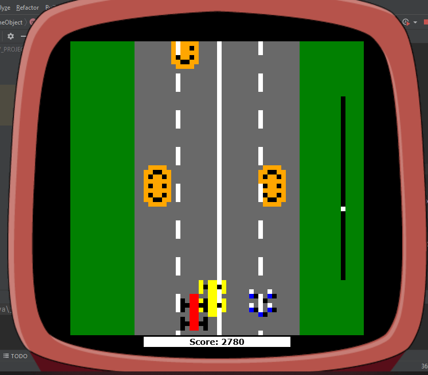

# GameRacer
Racer 2D is a game written in Java

## Table of contents
* [General info](#general-info)
* [Technologies](#technologies)
* [Setup](#setup)
* [View](#view)

## General info
The Game - Racer 2D is an application written in Java.  
The goal of the game is to get to the finish line bypassing all the obstacles with the maximum scores  
(cars that are coming towards you and spikes on the roadway)  

	
## Technologies
Project is created with:
* Java: 1.8
* lib: desktop-game-engine.jar
	
## Setup
To run this project, create a simple java application and copy the source code.  
Download the desktop-game-engine.jar.  
Then add the downloaded .jar file to your IDE in the library section.

## View
After starting the application, the game will start, and the player car appears on the road.

Player can control the car using arrows on the keyboard
* LEFT button (to move left side)
* RIGHT button (to move right side)
* UP button (for boosting) 
 

The progress bar on the right shows how far from the finish line player's car is.  

